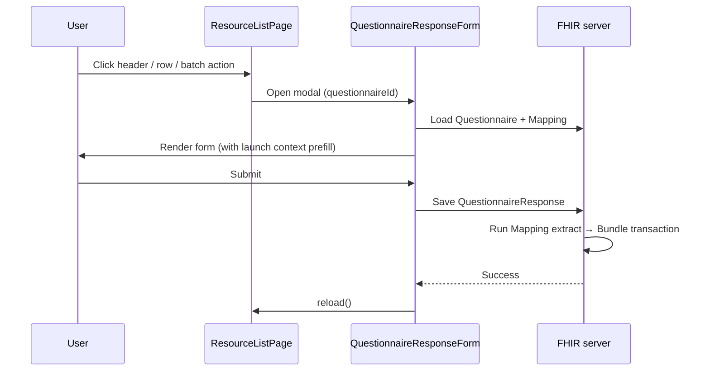

# Questionnaire actions

Header, row, and batch buttons on [`ResourceListPage`](./resource-list-page.md) can open questionnaire modals instead of custom React forms. You define two FHIR resources:

1. **`Questionnaire`** — the form UI (items, validation, launch context, prefill expressions).
2. **`Mapping`** — an extraction template that turns the submitted `QuestionnaireResponse` into a FHIR `Bundle` transaction (create, update, or delete resources).

Beda EMR loads the questionnaire by id, renders it in a modal, runs the linked mapping on submit, and applies the resulting bundle to the FHIR server. No custom save logic is required in the list page container.

Mapping templates use the [FHIRPath Mapping Language](https://github.com/beda-software/FHIRPathMappingLanguage) (JSON/YAML data DSL with `{{ }}` FHIRPath expressions). Older Beda EMR mappers may use [JUTE](https://github.com/healthSamurai/jute.clj); new mappers should prefer FHIRPath.

## End-to-end flow



At the code level, a `questionnaireAction` opens [`QuestionnaireResponseForm`](https://github.com/beda-software/fhir-emr/blob/main/src/components/QuestionnaireResponseForm/index.tsx) via [`questionnaireIdLoader`](https://github.com/beda-software/fhir-questionnaire):

```tsx
questionnaireAction(<Trans>Add patient</Trans>, 'patient-create')
```

The second argument (`patient-create`) must match the `Questionnaire.id` stored on the FHIR server.

## Step 1 — Define the Questionnaire

Create a `Questionnaire` resource with:

| Field | Purpose |
| ----- | ------- |
| `id` | Stable identifier referenced by `questionnaireAction` |
| `status` | `active` for production forms |
| `item` | Form fields (`linkId`, `type`, `text`, validation, widgets) |
| `mapping` | Link to the extract mapping (see step 2) |
| `launchContext` | Expected context parameters (for edit/confirm flows) |
| `initialExpression` | FHIRPath prefill on items from launch context |
| `meta.profile` | `https://emr-core.beda.software/StructureDefinition/fhir-emr-questionnaire` |

**Header action example — create patient** ([`patient-create.yaml`](https://github.com/beda-software/fhir-emr/blob/main/resources/init-seeds/Questionnaire/patient-create.yaml)):

```yaml
id: patient-create
resourceType: Questionnaire
name: patient-create
title: Patient create
status: active
mapping:
  - reference: urn:uuid:Mapping:patient-create
item:
  - linkId: last-name
    type: string
    text: Last name
    required: true
  - linkId: first-name
    type: string
    text: First name
    required: true
  - linkId: birth-date
    type: date
    text: Birth date
  # ...
meta:
  profile:
    - https://emr-core.beda.software/StructureDefinition/fhir-emr-questionnaire
```

Create flows typically need only `item` definitions — no `launchContext` unless the form must read session context (for example, the current `Author`).

**Row action example — confirm payment** ([`pay-invoice.yaml`](https://github.com/beda-software/fhir-emr/blob/main/resources/init-seeds/Questionnaire/pay-invoice.yaml)):

Edit and confirm flows declare `launchContext` and use `initialExpression` to copy resource ids into hidden fields:

```yaml
id: pay-invoice
resourceType: Questionnaire
status: active
title: Pay invoice
mapping:
  - reference: urn:uuid:Mapping:pay-invoice-extract
launchContext:
  - name:
      code: Invoice
    type:
      - Invoice
item:
  - linkId: current-invoice-id
    type: string
    hidden: true
    initialExpression:
      language: text/fhirpath
      expression: "%Invoice.id"
  - linkId: are-you-sure
    type: display
    text: Are you sure to pay this invoice?
```

The list page passes the row resource as launch context automatically for row actions (see [Launch context by action type](#launch-context-by-action-type)).

## Step 2 — Define the Mapping

Create a `Mapping` resource with:

| Field | Purpose |
| ----- | ------- |
| `id` | Referenced from `Questionnaire.mapping` |
| `type` | `FHIRPath` for FHIRPath Mapping Language |
| `body` | Extraction template — usually a `Bundle` with `type: transaction` |

**Create example** ([`patient-create.yaml` mapping](https://github.com/beda-software/fhir-emr/blob/main/resources/init-seeds/Mapping/patient-create.yaml)):

```yaml
id: patient-create
resourceType: Mapping
type: FHIRPath
body:
  "":
    - lastName: "{{ %QuestionnaireResponse.answers('last-name') }}"
    - firstName: "{{ %QuestionnaireResponse.answers('first-name') }}"
    - birthDate: "{{ %QuestionnaireResponse.answers('birth-date') }}"

  resourceType: Bundle
  type: transaction
  entry:
    - request:
        method: POST
        url: /Patient
      resource:
        resourceType: Patient
        active: true
        name:
          - family: "{{ %lastName }}"
            given:
              - "{{ %firstName }}"
        birthDate: "{{ %birthDate }}"
```

`QuestionnaireResponse.answers('linkId')` is an Aidbox helper that reads answers by `linkId`. You can also use standard FHIRPath over `%QuestionnaireResponse.repeat(item)...`.

**Update example** — conditional POST vs PATCH ([`patient-create` mapping](https://github.com/beda-software/fhir-emr/blob/main/resources/init-seeds/Mapping/patient-create.yaml)):

```yaml
entry:
  - request:
      "{% if %patientId.exists() %}":
        url: "/Patient/{{ %patientId }}"
        method: PATCH
      "":
        url: /Patient
        method: POST
    resource:
      resourceType: Patient
      # ...
```

**Multi-resource transaction** ([`healthcare-service-create-extract.yaml`](https://github.com/beda-software/fhir-emr/blob/main/resources/init-seeds/Mapping/healthcare-service-create-extract.yaml)) — one form creates `HealthcareService` and `ChargeItemDefinition` with internal `urn:uuid:` references.

### FHIRPath Mapping Language essentials

Full specification: [FHIRPathMappingLanguage README](https://github.com/beda-software/FHIRPathMappingLanguage).

| Syntax | Meaning |
| ------ | ------- |
| `"field": "literal"` | Constant value |
| `"field": "{{ expression }}"` | First result of FHIRPath expression |
| `"field": "{[ expression ]}"` | Array result |
| `` | Scoped variables (`%varName` in later expressions) |
| `` / `` | Conditional object branches |
| `` | Iterate and build array entries |
| `` | Merge multiple objects |

Context available to the mapper includes:

- `%QuestionnaireResponse` — the submitted response
- Launch context resources — for example `%Patient`, `%HealthcareService`, `%Invoice`
- `%Author` and other session parameters from [Clinical context](./clinical-context.md)

Use SDC IDE or the [TypeScript reference implementation](https://github.com/beda-software/FHIRPathMappingLanguage/tree/main/ts/server) to test templates against sample context.

## Step 3 — Link Questionnaire to Mapping

In the Questionnaire, reference the Mapping by id:

```yaml
mapping:
  - reference: urn:uuid:Mapping:patient-create
```

The `Mapping.id` must match the suffix (`patient-create` in this example).

## Step 4 — Deploy to the FHIR server

Beda EMR ships questionnaires and mappings as seed files:

- Questionnaires: [`fhir-emr/resources/init-seeds/Questionnaire/`](https://github.com/beda-software/fhir-emr/tree/main/resources/init-seeds/Questionnaire)
- Mappings: [`fhir-emr/resources/init-seeds/Mapping/`](https://github.com/beda-software/fhir-emr/tree/main/resources/init-seeds/Mapping)

In a [custom EMR build](./custom-emr-build.md), add your YAML files to `contrib/fhir-emr/resources/init-seeds/` (or the equivalent path in your fork). Aidbox loads them on startup when the `init-seeds` volume is mounted (see `compose.yaml`).

You can also create or edit questionnaires at runtime via the FHIR API or the in-app [Form Builder](../User%20Guide/Form%20Builder.md) / SDC IDE.

## Step 5 — Wire the action in a list page

Import `questionnaireAction` and register it in the appropriate callback on [`ResourceListPage`](./resource-list-page.md):

```tsx
import { ResourceListPage, questionnaireAction } from 'src/uberComponents/ResourceListPage';

<ResourceListPage<Patient>
    headerTitle={t`Patients`}
    resourceType="Patient"
    getHeaderActions={() => [
        questionnaireAction(<Trans>Add patient</Trans>, 'patient-create', { icon: <PlusOutlined /> }),
    ]}
    getRecordActions={(record) => [
        questionnaireAction(<Trans>Edit</Trans>, 'patient-edit'),
    ]}
    getBatchActions={() => [
        questionnaireAction(<Trans>Archive selected</Trans>, 'patient-archive-batch'),
    ]}
    // ...
/>
```

| Callback | Button location | When to use |
| -------- | --------------- | ----------- |
| `getHeaderActions` | Page header (primary button) | Create, import, bulk setup |
| `getRecordActions` | Per-row Actions column | Edit, confirm, cancel, status change |
| `getBatchActions` | Batch bar above table (requires row selection) | Operations on multiple selected records |

`getBatchActions` receives a `Bundle` of selected resources and enables row checkboxes automatically.

## Launch context by action type

Questionnaire actions merge launch context from [Clinical context](./clinical-context.md) (`Author`, session resources), `defaultLaunchContext` on the list page, `getClinicalContext(record)`, and action-specific parameters.

| Action type | What the form receives | Questionnaire design |
| ----------- | ---------------------- | -------------------- |
| **Header** | `getClinicalContext(undefined)` merged with `defaultLaunchContext` | Create forms — usually no `launchContext` required; use for empty resource populate |
| **Row** | Row resource as `{ name: resourceType, resource }` plus merged clinical context | Declare `launchContext` for expected resource types; prefill with `initialExpression` |
| **Batch** | Selected resources as individual parameters **and** a `Bundle` parameter containing all selected rows | Declare `Bundle` in `launchContext`; iterate `%Bundle.entry` in the mapping |

### Header action — create medication

[`MedicationManagement`](https://github.com/beda-software/fhir-emr/blob/main/src/containers/MedicationManagement/index.tsx):

```tsx
getHeaderActions={() => [
    questionnaireAction(<Trans>Add Medication</Trans>, 'medication-knowledge-create', { icon: <PlusOutlined /> }),
]}
```

The questionnaire ([`medication-knowledge-create.yaml`](https://github.com/beda-software/fhir-emr/blob/main/resources/init-seeds/Questionnaire/medication-knowledge-create.yaml)) only defines `item` fields. The mapping ([`medication-knowledge-create-extract.yaml`](https://github.com/beda-software/fhir-emr/blob/main/resources/init-seeds/Mapping/medication-knowledge-create-extract.yaml)) creates a `MedicationKnowledge` with ingredients, packaging, and cost.

### Row action — edit healthcare service

[`HealthcareServiceList`](https://github.com/beda-software/fhir-emr/blob/main/src/containers/HealthcareServiceList/index.tsx):

```tsx
getRecordActions={(record) => [
    questionnaireAction(<Trans>Edit</Trans>, 'healthcare-service-edit'),
]}
```

The edit questionnaire ([`healthcare-service-edit.yaml`](https://github.com/beda-software/fhir-emr/blob/main/resources/init-seeds/Questionnaire/healthcare-service-edit.yaml)) declares `launchContext: [HealthcareService]`, runs a `sourceQueries` bundle to load related `ChargeItemDefinition`, and prefills fields with `initialExpression` like `%HealthcareService.name`.

### Row action — pay invoice

[`InvoiceList`](https://github.com/beda-software/fhir-emr/blob/main/src/containers/InvoiceList/index.tsx) uses `pay-invoice` and `cancel-invoice` questionnaires. The mapping ([`pay-invoice-extract.yaml`](https://github.com/beda-software/fhir-emr/blob/main/resources/init-seeds/Mapping/pay-invoice-extract.yaml)) PATCHes the invoice status:

```yaml
entry:
  - request:
      method: PATCH
      url: "/Invoice/{{ %currentInvoiceId }}"
    resource:
      status: balanced
```

### Batch action — operate on selected rows

When users select rows, `BatchQuestionnaireAction` passes a `Bundle` of selected resources into launch context alongside per-row parameters. Design the questionnaire to accept `Bundle` and iterate in the mapping:

```yaml
# Questionnaire excerpt
launchContext:
  - name:
      code: Bundle
    type:
      - Bundle
```

```yaml
# Mapping excerpt — patch status for each selected Patient
body:
  resourceType: Bundle
  type: transaction
  entry:
    - "{% for entry in %Bundle.entry %}":
        request:
          method: PATCH
          url: "/Patient/{{ %entry.resource.id }}"
        resource:
          active: false
```

Register on the list page:

```tsx
getBatchActions={() => [
    questionnaireAction(<Trans>Deactivate selected</Trans>, 'patient-deactivate-batch'),
]}
```

Batch launch context is built from `defaultLaunchContext`, per-row `getClinicalContext` results, and the `Bundle` parameter. See [Clinical context — Resource list pages](./clinical-context.md#resource-list-pages-resourcelistpage) for merge rules.

## Advanced questionnaire features

### `sourceQueries` and contained bundles

Edit forms often need related data beyond the primary resource. The healthcare service edit questionnaire loads `ChargeItemDefinition` via a contained search bundle:

```yaml
contained:
  - resourceType: Bundle
    id: ChargeItemDefinitionBundle
    type: transaction
    entry:
      - request:
          method: GET
          url: /ChargeItemDefinition?healthcare-service={{%HealthcareService.id}}
sourceQueries:
  - reference: "#ChargeItemDefinitionBundle"
```

Prefill price fields from the query result:

```yaml
initialExpression:
  language: text/fhirpath
  expression: "%ChargeItemDefinitionBundle.entry[0].resource.entry.resource.propertyGroup.priceComponent.where(type='base').amount.value"
```

### Repeating groups

[`medication-knowledge-create`](https://github.com/beda-software/fhir-emr/blob/main/resources/init-seeds/Questionnaire/medication-knowledge-create.yaml) uses a repeating `ingredients` group. The mapping iterates with `{% for ingredient in %ingredientsItems %}`.

### Multiple resources from one form

[`medication-batch-create`](https://github.com/beda-software/fhir-emr/blob/main/resources/init-seeds/Questionnaire/medication-batch-create.yaml) asks for `items-number`, `batch-number`, and `expiration-date`, then the mapping creates N `Medication` resources in one transaction. This is a single-form bulk create (not a list batch action), useful for header actions on detail tabs.

## Testing with SDC IDE

Use the in-app SDC IDE (`Edit in SDC IDE` on the Questionnaires list) to:

1. Set launch context parameters and verify `initialExpression` prefill.
2. Edit the Questionnaire YAML and preview the rendered form.
3. Edit the Mapping and inspect the extracted Bundle in real time.
4. Debug FHIRPath expressions with the built-in evaluator.

See the [Form Builder user guide](../User%20Guide/Form%20Builder.md) for SDC IDE workflow details.

## Built-in examples in Beda EMR

| Questionnaire id | Action type | List container |
| ---------------- | ----------- | -------------- |
| `patient-create` | Header | [`PatientList`](https://github.com/beda-software/fhir-emr/blob/main/src/containers/PatientList/index.tsx) |
| `healthcare-service-create` | Header | [`HealthcareServiceList`](https://github.com/beda-software/fhir-emr/blob/main/src/containers/HealthcareServiceList/index.tsx) |
| `healthcare-service-edit` | Row | [`HealthcareServiceList`](https://github.com/beda-software/fhir-emr/blob/main/src/containers/HealthcareServiceList/index.tsx) |
| `medication-knowledge-create` | Header | [`MedicationManagement`](https://github.com/beda-software/fhir-emr/blob/main/src/containers/MedicationManagement/index.tsx) |
| `medication-batch-create` | Header (detail tab) | [`MedicationManagementDetail`](https://github.com/beda-software/fhir-emr/blob/main/src/containers/MedicationManagementDetail/index.tsx) |
| `pay-invoice` / `cancel-invoice` | Row | [`InvoiceList`](https://github.com/beda-software/fhir-emr/blob/main/src/containers/InvoiceList/index.tsx) |
| `medication-request-confirm` | Row | [`Prescriptions`](https://github.com/beda-software/fhir-emr/blob/main/src/containers/Prescriptions/index.tsx) |
| `practitioner-create` | Header | [`PractitionerList`](https://github.com/beda-software/fhir-emr/blob/main/src/containers/PractitionerList/index.tsx) |

Browse all seeds: [`resources/init-seeds/`](https://github.com/beda-software/fhir-emr/tree/main/resources/init-seeds).

## Related documentation

- [Resource list page](./resource-list-page.md) — `questionnaireAction`, header/row/batch action wiring
- [Clinical context](./clinical-context.md) — launch parameters for questionnaires
- [FHIRPath Mapping Language](https://github.com/beda-software/FHIRPathMappingLanguage) — mapping DSL specification and examples
- [Form Builder](../User%20Guide/Form%20Builder.md) — SDC IDE and AI-assisted questionnaire authoring
